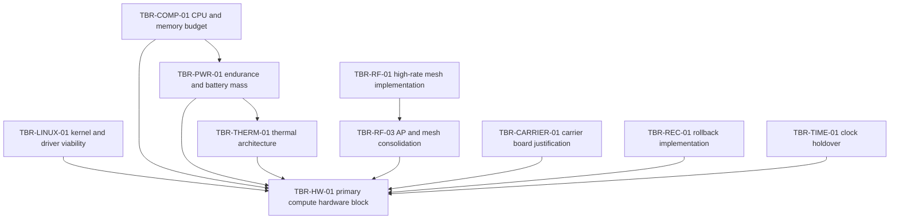

# Trade register

A trade is an open engineering question whose answer has consequences the
program cannot absorb silently. Each one gets a stable ID in the
`TBR-<AREA>-##` namespace, a named owner, and a stated closure gate.

`TBR` is read as "to be resolved" in this program. It marks a question, not a
value; a specific unknown value is written `TBD` and cites the trade that will
supply it.

## Identifier rules

1. **IDs are permanent and never reused**, including after a trade is closed,
   merged into another, or abandoned.
2. **Filename is `TBR-<AREA>-##-slug.md`.** `<AREA>` is upper case, the number
   is two digits, the slug is lower-case hyphenated.
3. **The `id` in frontmatter matches the filename.**
4. Areas in use: `LINUX`, `PWR`, `COMP`, `THERM`, `HW`, `RF`, `TAK`, `HA`,
   `SEC`, `TIME`, `REC`, `CARRIER`, `NET`. A new area is fine; add it here in
   the same change.

Allocate an ID with `tools/new-trade.sh RF "Question in sentence case"`.

## Status vocabulary

| Status | Meaning |
| --- | --- |
| `OPEN` | Question stated, not answered. |
| `IN WORK` | Someone is actively producing the evidence. Has an owner who is not `TBD`. |
| `BLOCKED` | Cannot proceed until a dependency closes or a resource exists. The blocker is named in the file. |
| `CLOSED` | Answered, with evidence committed under `docs/evidence/<TRADE-ID>/` and a decision recorded as an ADR. |
| `ABANDONED` | No longer relevant. The reason is recorded. The ID is retained and never reused. |

## Closure

**No trade closes on document wording alone.** Rewriting a trade document more
confidently is not closure, and it is the most common way a program convinces
itself it has decided something.

A trade closes when all four hold:

1. The evidence its closure gate demands exists, and is committed under
   `docs/evidence/<TRADE-ID>/` with instrument, date, node and configuration
   recorded where it is a measurement.
2. An ADR records the resulting decision and cites the evidence path.
3. The trade file's status is `CLOSED`, citing that ADR and that path.
4. `tools/validate-docs.sh` passes.

A closure that cites no path under `docs/evidence/` is not a closure. A closure
whose supporting datasheet has since 404'd is not verifiable, which is why
datasheets are archived into the repository rather than linked. See
`docs/evidence/README.md`.

## Frontmatter

```yaml
---
id: TBR-LINUX-01
title: Kernel and out-of-tree driver viability
status: OPEN
owner: TBD
area: LINUX
critical-path: true
depends-on: []
feeds: [TBR-HW-01, TBR-RF-01]
evidence: docs/evidence/TBR-LINUX-01/
adr: []
---
```

- `owner` is a name or `TBD`. **`TBD` is not acceptable on a critical-path
  trade**; that combination is reported in `STATUS.md` as a program risk.
- `depends-on` lists trades that must close first. `feeds` lists trades that
  consume this one's answer. Both are flow sequences of IDs, or `[]`.
- `evidence` is the directory path, which must exist.
- `adr` lists ADRs that record or depend on the outcome.

## Required sections

`tools/validate-docs.sh` requires all six.

- **Question** - one sentence. If it takes a paragraph, it is more than one
  trade.
- **Why it matters** - what breaks or stalls while this is open.
- **Options** - what is genuinely being considered, including doing nothing.
- **Closure evidence** - specifically what artifact would answer it. Name the
  measurement, the instrument class, the conditions.
- **Closure gate** - the condition under which the program agrees it is
  answered. Written before the work, so the answer cannot be graded against a
  standard invented afterwards.
- **Dependencies** - what must close first, what waits on this.

## The critical path

Two trades are currently on the critical path.

**`TBR-LINUX-01`, kernel and out-of-tree driver viability.** Almost everything
in `os/` waits on it. If a patched vendor kernel tree is required, the program
acquires a maintained fork, which needs an owner, a rebase cadence, and an
entry under `docs/forks/`. It also constrains which compute modules are viable
at all, so it feeds hardware selection. It **requires hardware** and cannot
start until a candidate module and radio are in hand.

**`TBR-TAK-01`, mission-critical state boundary.** It determines what the
mission-service plane must guarantee, which shapes the service catalog, the
identity design, and the recovery behaviour. It is on the critical path because
several service-plane trades wait behind it.

**`TBR-TAK-01` requires no hardware and can proceed in parallel.** It is a
design and analysis trade, resolvable against documentation, the upstream
protocol behaviour, and reasoning about partition. Anyone can pick it up today,
without owning a node, and it is the highest-value thing an unequipped
contributor can do for this program.

## Trades feeding hardware selection

`TBR-HW-01` cannot close before the trades that constrain it do. This is the
dependency structure that most often gets missed, so it is stated explicitly:



Selecting hardware before these close is how a program ends up requalifying an
enclosure it has already had made.

## Register

`STATUS.md` carries the generated current view. This table is a reading aid.

| ID | Title | Status | Owner | Critical path |
| --- | --- | --- | --- | --- |
| `TBR-LINUX-01` | Kernel and out-of-tree driver viability | `OPEN` | `TBD` | yes |
| `TBR-PWR-01` | Endurance and battery mass | `OPEN` | `TBD` | no |
| `TBR-COMP-01` | CPU and memory budget | `OPEN` | `TBD` | no |
| `TBR-THERM-01` | Thermal architecture | `OPEN` | `TBD` | no |
| `TBR-HW-01` | Primary compute hardware block | `OPEN` | `TBD` | no |
| `TBR-RF-01` | High-rate mesh implementation | `OPEN` | `TBD` | no |
| `TBR-RF-02` | Sub-GHz coexistence controls | `OPEN` | `TBD` | no |
| `TBR-RF-03` | Access point and mesh radio consolidation | `OPEN` | `TBD` | no |
| `TBR-TAK-01` | Mission-critical state boundary | `OPEN` | `TBD` | yes |
| `TBR-HA-01` | Safe automatic service recovery | `OPEN` | `TBD` | no |
| `TBR-SEC-01` | Protected storage unlock | `OPEN` | `TBD` | no |
| `TBR-TIME-01` | Clock holdover and skew tolerance | `OPEN` | `TBD` | no |
| `TBR-REC-01` | Rollback implementation | `OPEN` | `TBD` | no |
| `TBR-CARRIER-01` | Carrier board justification | `OPEN` | `TBD` | no |
| `TBR-NET-01` | Field address prefix | `OPEN` | `TBD` | no |

Every owner is `TBD`, including both critical-path trades. That is the
program's current state and is reported as a risk in `STATUS.md` rather than
tidied away.
