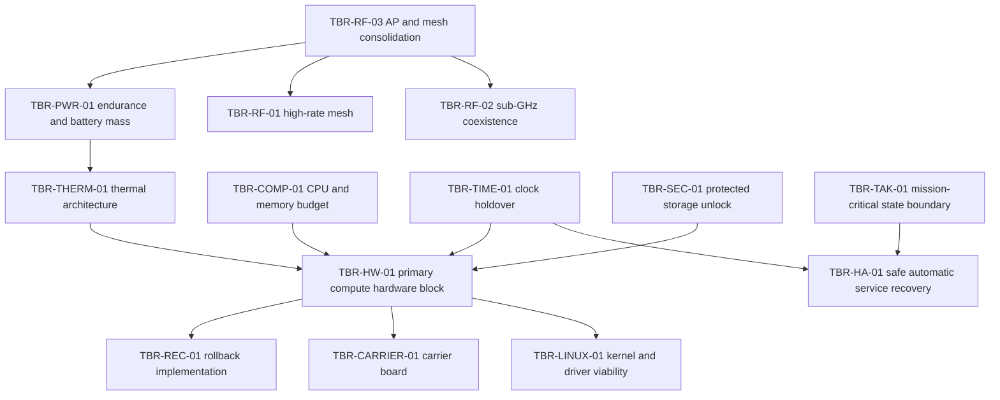

# Trade register

A trade is an open engineering question whose answer has consequences the
program cannot absorb silently. Each has a stable identifier in the
`TBR-<AREA>-##` namespace, a function owner, a named owner, and a stated closure
gate.

The register is transcribed from **SAD v0.31 section 30.2**, which is
controlling. `TBR` is read as "to be resolved". It marks a **question**; a
specific unknown value is written `TBD` and cites the trade that will supply it.

## Correction from the initial repository scaffold

The first version of this repository marked `TBR-LINUX-01` and `TBR-TAK-01` as
the two trades on the critical path. **That was a scaffolding assumption and it
is superseded by the SAD.**

SAD section 30.2 assigns a priority ordering in which `TBR-PWR-01` is first and
`TBR-LINUX-01` is eighth, and the SAD body marks **four** trades `CRITICAL`:

| Trade | SAD section | Priority |
| --- | --- | ---: |
| `TBR-PWR-01` | 25.1, "CRITICAL / FIRST HARDWARE TRADE" | 1 |
| `TBR-COMP-01` | 25.3, "CRITICAL" | 2 |
| `TBR-THERM-01` | 25.7, "CRITICAL" | 3 |
| `TBR-TAK-01` | 14.1, "CRITICAL" | 9 |

`TBR-TAK-01` is the only one carried over from the scaffold's list.
`TBR-LINUX-01` remains important — almost everything in `os/` waits behind it —
but the SAD places the **power, compute and thermal characterization** ahead of
it, because those three bound the hardware selection that `TBR-LINUX-01` itself
needs a candidate for.

The `critical-path` frontmatter field and `STATUS.md` now follow the SAD.

## Identifier rules

1. **Identifiers are permanent and never reused**, including after a trade is
   closed, merged into another, or abandoned.
2. **Filename is `TBR-<AREA>-##-slug.md`.**
3. **The `id` in frontmatter matches the filename.**
4. Areas in use: `PWR`, `COMP`, `THERM`, `RF`, `TIME`, `SEC`, `HW`, `LINUX`,
   `TAK`, `HA`, `REC`, `ID`, `NET`, `CARRIER`. A new area is fine; add it here
   in the same change.

Allocate one with `tools/new-trade.sh RF "Question in sentence case"`.

## Status vocabulary

| Status | Meaning |
| --- | --- |
| `OPEN` | Question stated, not answered. |
| `IN WORK` | Someone is actively producing the evidence. Has a named owner. |
| `BLOCKED` | Cannot proceed until a dependency closes or a resource exists. |
| `CLOSED` | Answered, with evidence under `docs/evidence/<TRADE-ID>/`, accepted by the named owner, and a decision recorded in the ADR register. |
| `ABANDONED` | No longer relevant. Reason recorded. Identifier retained. |

## Owners, and the SRR exit action

Every trade carries two owner fields:

- **`function-owner`** — the engineering function accountable, from SAD section
  30.2. For example `Power/Mechanical`, `TAK + SRE`, `Linux/Platform`.
- **`owner`** — a **named individual**.

SAD section 30.2 records an SRR exit action:

> the Program Owner assigns one named individual and one calendar target date to
> every open TBR.

Both halves of that action are now done: every trade names Cameron Zobrist as
owner (2026-08-31), and on 2026-09-04 the Program Owner set every open trade's
`target-date` to 2026-09-30. `STATUS.md` reports the resulting single-owner
concentration as a program risk, which is the second half of the same section
30.1 finding the assignment instantiates.

A trade **cannot** close while its named owner is `TBD-SRR`, because closure
requires the named owner to accept the evidence.

SAD section 31 separately carries "one individual owns too many TBRs/release
functions" as an OPEN risk, to be reviewed when the names are assigned.

## Closure

**No trade closes on document wording alone.** SAD section 30.2:

> A TBR closes only when its listed evidence exists, the named owner accepts the
> evidence, and the resulting architecture decision is entered into the
> persistent ADR register.

So closure needs all four:

1. the evidence the closure gate demands, committed under
   `docs/evidence/<TRADE-ID>/`, with instrument, date, node and configuration
   recorded where it is a measurement;
2. acceptance by the named owner;
3. an ADR recording the decision and citing the evidence path;
4. `tools/validate-docs.sh` passing.

## Required sections

`tools/validate-docs.sh` requires all six: **Question**, **Why it matters**,
**Options**, **Closure evidence**, **Closure gate**, **Dependencies**.

The closure gate is written **before** the work, so the result cannot be graded
against a standard invented after seeing it.

## Register

Ordered by SAD section 30.2 priority. `STATUS.md` carries the generated view.

| Pri | ID | Question | Status | Function owner | Named owner | HW | Critical |
| ---: | --- | --- | --- | --- | --- | --- | --- |
| 1 | `TBR-PWR-01` | Endurance and battery mass | `OPEN` | Power/Mechanical | `TBD-SRR` | yes | **yes** |
| 2 | `TBR-COMP-01` | CPU and memory budget | `OPEN` | Platform + TAK | `TBD-SRR` | partly | **yes** |
| 3 | `TBR-THERM-01` | Thermal architecture | `OPEN` | Power/Mechanical + Platform | `TBD-SRR` | yes | **yes** |
| 4 | `TBR-RF-03` | Access point and mesh radio consolidation | `OPEN` | Network + RF | `TBD-SRR` | yes | no |
| 5 | `TBR-TIME-01` | Clock holdover and skew tolerance | `OPEN` | Platform + Security | `TBD-SRR` | yes | no |
| 6 | `TBR-SEC-01` | Protected storage unlock | `OPEN` | Security + Hardware | `TBD-SRR` | partly | no |
| 7 | `TBR-HW-01` | Primary compute hardware block | `OPEN` | Systems + Builder | `TBD-SRR` | yes | no |
| 8 | `TBR-LINUX-01` | Kernel and out-of-tree driver viability | `OPEN` | Linux/Platform | `TBD-SRR` | yes | no |
| 9 | `TBR-TAK-01` | Mission-critical state boundary | `OPEN` | TAK + SRE | `TBD-SRR` | no | **yes** |
| 10 | `TBR-RF-01` | High-rate mesh implementation | `OPEN` | Network + RF | `TBD-SRR` | yes | no |
| 11 | `TBR-RF-02` | Sub-GHz coexistence controls | `OPEN` | RF/Spectrum | `TBD-SRR` | yes | no |
| 12 | `TBR-HA-01` | Safe automatic service recovery | `OPEN` | SRE + TAK | `TBD-SRR` | partly | no |
| 13 | `TBR-REC-01` | Rollback implementation | `OPEN` | Platform + CM | `TBD-SRR` | yes | no |
| 14 | `TBR-ID-01` | Browser-service identity provider | `OPEN` | Security/Identity | `TBD-SRR` | no | no |
| 15 | `TBR-NET-01` | Field address prefix | `OPEN` | Network | `TBD-SRR` | no | no |
| 16 | `TBR-CARRIER-01` | Carrier board justification | `OPEN` | Builder + Power + RF | `TBD-SRR` | yes | no |

### Raised after the SAD register

These have no SAD section 30.2 position, so they carry `priority: 99` and sit
outside the table above rather than being given an invented rank. The absence
of a rank is not a judgement about importance: both feed trades the SAD does
rank. They were missing from this page until 2026-08-30, which is how a
register drifts from the directory it describes.

| ID | Question | Status | Function owner | Named owner | HW | Feeds |
| --- | --- | --- | --- | --- | --- | --- |
| `TBR-NET-02` | How does a node address the EUDs behind it | `OPEN` | Network | Cameron Zobrist | no | `TBR-ID-01` |
| `TBR-NET-03` | How do two deployments converge on one mesh | `OPEN` | Network | Cameron Zobrist | no | `TBR-NET-01` |
| `TBR-VOICE-01` | Which RoIP gateway implementation, thin native or a framework | `OPEN` | Network | Cameron Zobrist | partly | `CCR-03` |

## What can be worked without hardware

Four trades need no hardware, and one of them is `CRITICAL`:

- **`TBR-TAK-01`, mission-critical state boundary.** Priority 9 and marked
  `CRITICAL`. A design and analysis trade, resolvable against documentation,
  protocol behaviour and reasoning about partition, running against fakes on an
  ordinary laptop. `TBR-HA-01` and `FML-ADR-034` both wait on it. **This is the
  highest-value work available to a contributor who owns no node.**
- **`TBR-NET-01`, field address prefix.** Whether to retain `10.41.0.0/16`. The
  collision case can be exercised with virtual interfaces, and has been:
  `docs/evidence/TBR-NET-01/`.
- **`TBR-NET-03`, how two deployments converge on one mesh.** Analysis, plus an
  exercise on virtual interfaces. **Read this before `TBR-NET-01`.** `mesh_id`
  separates deployments by construction, so converging is the event that makes
  the address collision reachable at all; assessing the prefix first assesses a
  consequence before establishing that its cause can occur.
- **`TBR-ID-01`, browser-service identity provider.** Workflow analysis and
  offline login against fakes.

Two more are `partly` workable without hardware: `TBR-SEC-01`, whose analysis
against the capture scenarios is the larger half, and `TBR-COMP-01`, whose
service-plane measurements can be taken on an ordinary machine against fakes.

## Dependency graph

From SAD section 30.3. This is the architecture-driven schedule until calendar
dates are assigned.

SAD section 30.3 draws four conclusions from it:

- **`TBR-HW-01` is a convergence decision**, not an independent early choice.
- **`TBR-TIME-01` constrains both hardware and HA.**
- **`TBR-SEC-01` may add a TPM or secure-element requirement**, and therefore
  constrains hardware and carrier selection.
- **`TBR-RF-03` affects power, thermal, antenna count, the high-rate
  architecture and coexistence testing**, which is why it sits at the head of
  the graph despite being priority 4.

Selecting hardware before these close is how a program ends up requalifying an
enclosure it has already had made.
