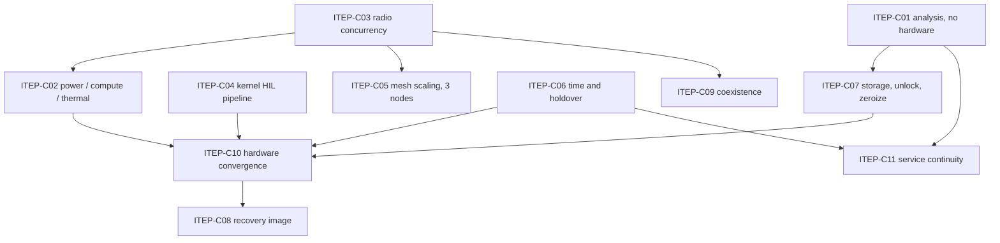

# FML/MULE Integrated Test and Evaluation Plan (ITEP)

**Version:** 0.1
**Status:** DRAFT
**Parents:** FML/MULE CONOPS v1.01 BASELINE; FML/MULE SAD v0.31 DRAFT
**Document type:** Program-control document
**Authored in this repository.** Unlike the CONOPS and the SAD, this document is
not a transcription. It is written here, follows this repository's conventions,
and is linted like any other file.

---

## 0. Document control

### 0.1 Purpose

SAD v0.31 section 33.1 names this document:

> **FML/MULE Integrated Test & Evaluation Plan (ITEP) v0.1**
> Convert the TBR dependency graph and CONOPS qualification stages into
> executable test campaigns, test rigs, instrumentation, prototype quantities,
> evidence paths, owners, and schedule.
>
> The ITEP is the next major program-control document.

It is the third of the three artifacts SAD section 33.1 says should proceed
immediately. The other two exist: the ADR register is `docs/adr/`, and PBCR-01
is `docs/change-requests/PBCR-01-field-service-plane.md`.

### 0.2 What this document does

Groups the sixteen open trades into **eleven campaigns**, each with a rig, an
instrumentation set, a procurement gate dependency, an evidence path and an
owner. Orders the campaigns by dependency. Names the activities that are bound
by elapsed time rather than effort, because those are the ones that become the
long pole if they are started late.

### 0.3 What this document deliberately does not do

- **It does not invent dates.** SAD section 30.2: *"No calendar schedule has yet
  been baselined for FML/MULE. This SAD therefore does not invent dates."* The
  same restraint applies here. Sequencing is expressed as dependency-ordered
  tranches; every date field reads `TBD-SRR`.
- **It does not define stage pass criteria.** Those need a selected hardware
  block (`TBR-HW-01`) and measured baselines. `test/stages/` records scope for
  each of the thirteen CONOPS section 78 stages; turning scope into a definition
  is downstream of this plan, not part of it.
- **It does not restate closure evidence or closure gates.** Those are in each
  trade file, transcribed from SAD section 30.2, and are authoritative. This
  plan says *how and in what order* to produce them, not *what* they are. The
  two must not drift.
- **It is not the ATP.** Unit acceptance per CONOPS section 74 is a separate
  document.

### 0.4 Judgement calls made in authoring this plan

Recorded explicitly, because they are the parts not derived from a controlling
document and therefore the parts most likely to be wrong.

| # | Judgement | Basis | How to overturn it |
| ---: | --- | --- | --- |
| 1 | Grouping trades into campaigns by **shared rig** rather than by priority order | SAD section 25.7 directs `TBR-PWR-01` and `TBR-THERM-01` to share an instrumented rig "to avoid duplicate prototype builds"; SAD section 33.2 asks for one rig collecting power, temperature, CPU, RAM and network performance simultaneously | Reorder campaigns; the trades and their gates are unchanged |
| 2 | Running the **no-hardware campaign first**, ahead of priority 1 | It costs nothing, requires no purchase, and `TBR-TAK-01` gates `TBR-HA-01`, `FML-ADR-034` and three of the four placeholder services | If analysis capacity is the scarce resource rather than money, run it in parallel instead |
| 3 | Starting **`TBR-TIME-01` drift measurement early** despite priority 5 | Its closure evidence is measured "over at least the required holdover duration", which is elapsed-time bound, not effort bound | Only if the required holdover duration turns out to be short |
| 4 | Splitting `TBR-COMP-01` and `TBR-SEC-01` into a **no-hardware half and a hardware half** | Both trade files record `requires-hardware: partly` with the split stated | Treat each as monolithic if the split creates more bookkeeping than it saves |
| 5 | Measuring the **four-radio planning baseline** for power before `TBR-RF-03` closes | `FML-ADR-045` makes four radios the planning baseline precisely so power and BOM work can proceed; SAD section 30.3 nonetheless shows `TBR-RF-03` feeding `TBR-PWR-01` | If `TBR-RF-03` closes early, measure the consolidated case instead and skip the remeasure |

---

## 1. Entry conditions

**This plan cannot be executed as written until one condition is met.**

### 1.1 Named owners - BLOCKING

SAD section 30.2 records an SRR exit action:

> the Program Owner assigns one named individual and one calendar target date to
> every open TBR.

and states that a TBR closes only when its evidence exists, **the named owner
accepts the evidence**, and the resulting decision is entered into the ADR
register.

**All sixteen trades currently read `TBD-SRR`.** Work can be performed against
this plan, and evidence can be gathered, but **no trade can close**, because
there is nobody empowered to accept the evidence. Campaigns will complete and
their trades will remain `OPEN`.

SAD section 31 additionally carries *"one individual owns too many TBRs/release
functions"* as an OPEN risk, to be reviewed once names exist. This plan assigns
eleven campaigns across seven function owners; if fewer than seven people are
available, that risk is realised and should be recorded rather than absorbed.

### 1.2 Non-blocking, but assumed

- Procurement gate 1 released, for every campaign except `ITEP-C01`.
- `MAINTAINERS.md` roles filled, or the program accepting that they are not.
- The `docs/evidence/<TRADE-ID>/` directories exist. They do.

---

## 2. Test articles

From the prototype and test BOM, `hardware/prototype/`. Quantities are what that
BOM buys, not what a fleet needs.

| Article | Qty | Configuration | Serves |
| --- | ---: | --- | --- |
| Full field-configuration node | 2 | Complete build: compute, HaLow, high-rate Wi-Fi, EUD AP, LoRa, GNSS, RTC, enclosure, PD power | All campaigns |
| Minimal HaLow relay node | 1 | Bench-powered, HaLow only, no enclosure, no pack, no high-rate radio | `ITEP-C05` only |
| Shared test asset set | 1 | Instrumentation and consumables, section 3 | All hardware campaigns |
| EUD test clients | `TBD` | Not in the BOM. See section 8.3. | `ITEP-C03`, `ITEP-C05` |

### 2.1 What the relay node cannot do

The relay is HaLow-only, bench-powered, with no enclosure and no high-rate
radio. It therefore **cannot** participate in `ITEP-C02` (power, compute,
thermal), `ITEP-C03` (radio concurrency), `ITEP-C07` (storage and unlock) or
`ITEP-C09` (coexistence).

It exists for one reason, stated in the BOM: **two nodes give one hop and no
rerouting.** CONOPS Stage 2 asks about multi-hop, hop-count limits, topology
change and multicast scaling, and none of those is testable with two nodes.

### 2.2 A conflict this plan surfaces

SAD section 20.4 requires the hardware-in-the-loop release bench to be built
from **two representative nodes** and states:

> Bench hardware is a program/test asset and must be reserved in the prototype
> BOM rather than borrowed from the deployable fleet.

At prototype stage there is no deployable fleet, so the two full nodes serve as
both the trade-closure articles and the HIL bench. **That is acceptable now and
becomes a conflict the moment a fleet exists.**

`ITEP-C04` therefore carries an explicit exit condition: before any node is
fielded, the bench receives dedicated hardware. If that is not funded, the
release pipeline degrades into an ad hoc manual checklist, which SAD section 31
already carries as an OPEN risk.

---

## 3. Instrumentation

From the BOM shared test assets, plus what the campaigns require beyond it.

| Instrument | Source | Used by |
| --- | --- | --- |
| Inline DC power meter and logger, 0-30 V | BOM, `BUY NOW` | `ITEP-C02` |
| Dual-channel K-type thermocouple meter and probes | BOM, `BUY NOW` | `ITEP-C02` |
| USB-C 100 W PD source, 20 V / 5 A | BOM, `BUY NOW` | `ITEP-C02`, all bench work |
| USB2 SSD test article | BOM, `BUY AFTER COMP-01` | `ITEP-C07` |
| Spare RF pigtails, antennas, bulkheads | BOM, `BUY AFTER PANEL LAYOUT` | `ITEP-C03`, `ITEP-C09` |
| Traffic generator | **Not in the BOM.** Software; see section 8.3 | `ITEP-C03`, `ITEP-C05` |
| Controllable Ethernet / WAN path | **Not in the BOM.** Required by SAD section 20.4 | `ITEP-C04` |
| RF measurement capability for receive sensitivity | **Not in the BOM.** See section 8.3 | `ITEP-C09` |

### 3.1 The single-rig rule

SAD section 33.2:

> Where practical, one instrumented rig should collect power, temperature, CPU,
> RAM, and network performance simultaneously.

`ITEP-C02` is built around that instruction. Power, compute and thermal are one
campaign on one rig, not three campaigns on three rigs, because SAD section 25.7
warns against duplicate prototype builds and because a thermal measurement is
only interpretable alongside the load that produced it.

---

## 4. Rigs

| Rig | Contents | Campaigns |
| --- | --- | --- |
| **R0 Flat-sat** | `test/flatsat/`. The real node logic composed end to end, hardware layer faked. Software only; runs in CI. | `ITEP-C01`, and regression cover for every campaign that later touches software |
| **R1 Analysis** | An ordinary laptop. Fakes and recorded fixtures. A representative TAK build. No radios, no node. | `ITEP-C01` |
| **R2 Instrumented bench** | One full node, PD source, DC power logger, thermocouples, enclosure fit article when available | `ITEP-C02`, `ITEP-C06`, `ITEP-C07` |
| **R3 Multi-node RF** | Two full nodes plus the relay, EUD clients, traffic generator, open space | `ITEP-C03`, `ITEP-C05`, `ITEP-C09` |
| **R4 HIL release bench** | Two full nodes, all radios, EUD client, controllable Ethernet/WAN, power measurement, per SAD section 20.4 | `ITEP-C04`, `ITEP-C08` |

R2, R3 and R4 contend for the same two full nodes. That contention is the
program's real schedule constraint at prototype stage, and it is why the
sequencing in section 6 matters more than the priority ordering.

---

## 5. Campaigns

Campaign identifiers are permanent and never reused, on the same terms as
`FML-ADR-###` and `TBR-<AREA>-##`.

Every campaign names the trades it closes or advances, the CONOPS section 78
stage it feeds, the rig, the procurement gate it waits on, the evidence path,
and the function owner from SAD section 30.2. Named owners are `TBD-SRR`
throughout, per section 1.1.

### ITEP-C01 - Analysis, no hardware

**Trades:** `TBR-TAK-01` (pri 9, CRITICAL), `TBR-NET-01` (15), `TBR-ID-01` (14),
`TBR-SEC-01` analysis half (6), `TBR-COMP-01` service-plane half (2, CRITICAL),
`TBR-NET-02` (no SAD register position; see its frontmatter notes),
`TBR-NET-03` (no SAD register position; feeds `TBR-NET-01`)

**Rig:** R0 and R1. **Gate:** none. **Cost:** none.
**Stages:** 5, 2, 9, 1. **Criteria:** 3, 6, 8, 9, 22, 26, 27.
**Function owners:** TAK + SRE; Network; Security/Identity; Platform + TAK.
**Evidence:** `docs/evidence/TBR-TAK-01/`, `TBR-NET-01/`, `TBR-ID-01/`,
`TBR-SEC-01/`, `TBR-COMP-01/`, `TBR-NET-02/`, `TBR-NET-03/`.

**Why this campaign is first.** It requires no purchase, no hardware and no
gate. `TBR-TAK-01` alone gates `TBR-HA-01`, the `FML-ADR-034` database
condition, and three of the four placeholder service components. Running it last
would idle the largest block of dependent work for the entire hardware
programme.

**Work:**

1. **`TBR-TAK-01` state classification.** Enumerate every state object the
   mission-service plane holds against the ten categories in SAD section 14.1,
   classify each into a CONOPS section 26 class with a stated justification, and
   describe partition and rejoin behaviour for the durable set including its
   conflict resolution rule. SAD section 14.2 warns that ORM-claimed database
   support is not acceptance evidence.
2. **`TBR-COMP-01` service-plane half.** Measure resident memory and CPU for
   each catalog service under representative load on R1, against fakes. Peak as
   well as steady state: service start-up and a simulated client association
   storm.
3. **`TBR-SEC-01` analysis half.** Evaluate each unlock option in SAD section
   27.5.2 against the `THREAT_MODEL.md` capture scenarios, stating for each what
   an adversary holding a powered-off node obtains and what one holding a
   powered-on node obtains.
4. **`TBR-NET-01` collision analysis.** Whether retaining `10.41.0.0/16` creates
   unacceptable collision risk. Exercise the collision case with virtual
   interfaces.
5. **`TBR-ID-01` workflow analysis.** Whether the browser services need a common
   identity provider. Count authentication events with and without one.
6. **`TBR-NET-02` addressing specification.** How a node decides which of the
   four to eight EUDs behind it a message is for, across the CoT,
   browser-service and Meshtastic namespaces. Produce the mapping table, one
   worked end-to-end trace per plane, the LoRa tag encoding costed in bytes
   against the 233-byte `DATA_PAYLOAD_LEN`, and the unresolved-recipient rule.
   Runs before `TBR-ID-01` on purpose: it structures addressing so that
   authentication can be added to it rather than redesign it.
7. **`TBR-NET-03` convergence mechanism.** By what mechanism two independently
   built deployments come to share one mesh, or a written finding that MULE v1
   provides none. `mesh_id` is required by the mission package schema and
   separates deployments by construction, which is established; nothing says
   how they deliberately converge, and converging is the event that makes the
   `TBR-NET-01` collision reachable at all. **Runs before item 4 on purpose.**
   Assessing collision risk for a prefix is assessing a consequence, and
   whether the cause can occur is this item. Analysis plus an exercise on
   virtual interfaces; no hardware.

**Exit:** `TBR-TAK-01` produces a classification defensible enough for
`TBR-HA-01` to select a mechanism against. The remaining five produce written
analyses that their hardware halves can be measured against.

**Note:** This campaign can begin today, by one person, with no budget. That it
has not begun is a programme fact worth recording.

**R0, the flat-sat, is the persistent half of this campaign.** Analysis outputs
are documents; the flat-sat is executable and stays in CI, so a later change
that breaks the user flow is caught rather than rediscovered. Results from it
carry `SIMULATED` and never substitute for a hardware campaign.

---

### ITEP-C02 - Power, compute and thermal characterization

**Trades:** `TBR-PWR-01` (1, CRITICAL), `TBR-COMP-01` hardware half (2,
CRITICAL), `TBR-THERM-01` (3, CRITICAL)

**Rig:** R2. **Gate:** 1 for boards, radios, PD and instrumentation; **2** for
the enclosure fit article.
**Stages:** 7, 1, 8. **Criteria:** 21, 22, 31.
**Function owners:** Power/Mechanical; Platform + TAK; Power/Mechanical +
Platform.
**Evidence:** `docs/evidence/TBR-PWR-01/`, `TBR-COMP-01/`, `TBR-THERM-01/`.

This is SAD section 33.2 item 1, and the three highest-priority trades in the
register. One rig, simultaneous collection.

**C02a - free air, no enclosure.** Available at Gate 1, because the BOM
decouples power measurement from the battery by powering the prototype from
USB-C PD. Measures the eight load states in SAD section 25.1 and the
network-plane half of the compute budget.

**C02b - enclosed.** Waits on Gate 2, the enclosure fit article. Adds internal
air, component surface, cell and external surface temperature, throttling
behaviour, and packet loss and latency while thermally constrained.

**Measure the four-radio planning baseline** per `FML-ADR-045`, not a
consolidated configuration. If `ITEP-C03` later permits consolidation, remeasure
the reduced case; the delta is itself `TBR-RF-03` closure evidence.

**Exit:** a power model answering the nine questions in SAD section 25.1; a
compute budget stating normal and peak RAM, swap policy, CPU under worst
representative load, reserve margin, OOM behaviour and the **reservation
mechanism** that keeps the network plane alive; and a thermal characterization
across the CONOPS worst-case ambient, or a stated duty-cycle derating where it
cannot be met.

**Change-control trigger.** If the architecture cannot meet 8 hours with
acceptable pack mass, SAD section 25.1 fixes the response order: architecture
reduction first, external and vehicle packs second, and **a CONOPS change
request against the endurance objective third** — not a heavier battery quietly
added to the BOM.

---

### ITEP-C03 - EUD AP and high-rate radio concurrency

**Trades:** `TBR-RF-03` (4), `TBR-RF-01` (10)

**Rig:** R3. **Gate:** 1 for one high-rate card; quantity two waits on
`BUY 1 THEN VERIFY`.
**Stages:** 1, 4. **Criteria:** 11, 12.
**Function owner:** Network + RF.
**Evidence:** `docs/evidence/TBR-RF-03/`, `TBR-RF-01/`.

SAD section 33.2 item 2. SAD section 30.3 places `TBR-RF-03` at the head of the
dependency graph: it feeds power, thermal, antenna count, the high-rate
architecture and coexistence testing.

**Work:** the ten evidence items in SAD section 5.2, from supported concurrent
interface modes through to whether antennas can be internal, external or must be
field replaceable. Then `TBR-RF-01`: whether the high-rate bearer works as a
second batman-adv hard interface, including which metric each bearer receives
and which path traffic actually took.

**Why the antenna count is the output that matters most.** SAD section 25.4.1
sets a six-feed mechanical planning envelope, plus an optional seventh for GNSS,
and warns that **the enclosure must not be dimensioned around the earlier
three-radio mental model.** `ITEP-C10` and the enclosure both wait on this
number.

**Highest-risk item.** The BOM records the candidate high-rate card as the
highest-risk line in the BOM and gates it to one unit until PCIe routing, stack
height and kernel enumeration are verified. Do not buy two before that.

---

### ITEP-C04 - Kernel and HaLow lifecycle

**Trades:** `TBR-LINUX-01` (8)

**Rig:** R4. **Gate:** 1.
**Stage:** 2. **Criterion:** 12.
**Function owner:** Linux/Platform.
**Evidence:** `docs/evidence/TBR-LINUX-01/`.

SAD section 33.2 item 4. This campaign builds a **pipeline**, not a result.

SAD section 20.2: *"`TBR-LINUX-01` therefore closes on a repeatable
kernel-promotion pipeline, not merely a one-time successful driver build."* A
driver that builds once proves nothing about the next kernel.

**Work:** commission the R4 bench to the SAD section 20.4 minimum, then
implement and exercise the twelve-step release suite: clean boot, expected
kernel and modules, radio enumeration, EUD AP startup and association, EAP-TLS
admission where enabled, HaLow mesh formation, batman-adv neighbour and path
formation, high-rate bearer startup, representative multicast and CoT traffic,
service ingress, reboot, and rollback to the known-good image.

**Determine whether a patch set is required.** If one is, a `docs/forks/` entry
with a **named owner** must exist before the trade can be marked `CLOSED`.
Closing it with the owner as `TBD` is not permitted, and `MAINTAINERS.md`
currently records nobody who could take it.

**Exit condition beyond the trade:** the bench receives dedicated hardware
before any node is fielded. See section 2.2.

---

### ITEP-C05 - Mesh scaling and multi-hop

**Trades:** advances `TBR-RF-01`, `TBR-NET-01`

**Rig:** R3, all three nodes. **Gate:** 1, including gate 5, the relay node.
**Stage:** 2. **Criteria:** 2, 7, 12.
**Function owner:** Network + RF.
**Evidence:** `docs/evidence/TBR-RF-01/`, `TBR-NET-01/`.

CONOPS section 22 makes Stage 2 the point at which usable network size and
hop-count limits are determined, and states that bench-scale peer TAK
performance is **not** assumed to extend to a large field network.

**The measurement most likely to be skipped.** SAD section 4.3 requires
measuring not only CoT and PLI traffic but **ordinary EUD broadcast, multicast,
ARP, mDNS and discovery load** at representative client and hop counts, because
local EUD access is bridged into the BATMAN field domain. The architecture does
not assume normal phone broadcast behaviour is free on a constrained multi-hop
mesh. A campaign that measures only CoT will produce an optimistic and wrong
answer.

**This campaign is why the relay node is in the BOM.** Multi-hop, relay,
topology change and BATMAN reconvergence are not testable with two nodes.

---

### ITEP-C06 - Time, holdover and fail-closed behaviour

**Trades:** `TBR-TIME-01` (5)

**Rig:** R2, in parallel with other work. **Gate:** 1.
**Stages:** 1, 9. **Criterion:** 6.
**Function owner:** Platform + Security.
**Evidence:** `docs/evidence/TBR-TIME-01/`.

SAD section 33.2 item 7.

**Start this early despite its priority.** RTC drift is measured "over a
recorded interval at recorded temperatures, over at least the required holdover
duration". That is bound by **elapsed time, not effort**. A drift measurement
started late becomes the long pole regardless of how much attention it gets. See
section 7.1.

**Work:** measured RTC drift; backup-cell service life from the datasheet and
the measured standby current; demonstrated boot with a **dead backup cell**,
where the node must enter `TIME_DEGRADED`, refuse validation and say why; and
demonstrated rejoin between two nodes deliberately skewed beyond tolerance.

**Gates two other things.** SAD sections 14.4 and 14.7 make `TBR-TIME-01` a
precondition for `TBR-HA-01`, and SAD section 24.5.3 makes RTC availability,
backup-cell interface, RTC current draw and GNSS/PPS interface inputs to
`TBR-HW-01`.

---

### ITEP-C07 - Storage, unlock and zeroize

**Trades:** `TBR-SEC-01` hardware half (6); verifies `FML-ADR-044` and
`FML-ADR-050`

**Rig:** R2. **Gate:** 1; USB2 SSD test article after `TBR-COMP-01`.
**Stage:** 9. **Criteria:** 26, 27.
**Function owner:** Security + Hardware.
**Evidence:** `docs/evidence/TBR-SEC-01/`, `TBR-HW-01/`.

SAD section 33.2 item 8.

**Work:** demonstrated unlock and boot on candidate hardware for the option
`ITEP-C01` selected; demonstrated behaviour of the **rollback path** under the
same scheme, confirming it is not a way to boot the node without its
protections; demonstrated behaviour when the clock is not credible; and the
storage endurance evidence `TBR-HW-01` requires.

**Zeroize is verified destructively.** SAD section 30.1 records zeroize as OPEN
until **destructive test**, and SAD section 31 carries "sensitive data survives
zeroize" as an OPEN risk. Verifying `FML-ADR-044` means attempting recovery
after zeroize, not observing that the command returned zero.

**The storage question the BOM raises.** The carrier's single M.2 M-key slot is
consumed by the Wi-Fi card, leaving 32 GB eMMC for PostgreSQL, journald and
Prometheus. The USB2 SSD test article exists to characterise whether that is
survivable. This feeds `FML-ADR-050` and the `TBR-HW-01` storage criterion.

---

### ITEP-C08 - Recovery image and rollback

**Trades:** `TBR-REC-01` (13)

**Rig:** R4. **Gate:** after `TBR-HW-01` boot chain is known.
**Stages:** 1, 13. **Supports criterion:** 32.
**Function owner:** Platform + CM.
**Evidence:** `docs/evidence/TBR-REC-01/`.

SAD section 33.2 item 9.

**Work:** the four acceptance conditions in SAD section 20.3 — failed update,
corrupt active image, failed radio-driver promotion, operator-initiated rollback
— plus restoration to a known-good fleet baseline **without WAN**.

**The gate is a person, not a script.** `FML-ADR-041` requires recovery
"without disassembly and without a host computer", by a volunteer, following a
written procedure, using no tools beyond what the operational concept says they
carry. A rollback that only its author can perform has not closed this trade.

**The part usually skipped:** the currency policy. A known-good image two years
old may not understand the current mission package format or hold valid trust
material. Evidence must show the policy was followed across at least two
promotions.

---

### ITEP-C09 - Sub-GHz coexistence

**Trades:** `TBR-RF-02` (11)

**Rig:** R3, with the assembled enclosure. **Gate:** 2 and **6** — panel last.
**Stage:** 3. **Criteria:** 13, 14, 15.
**Function owner:** RF/Spectrum.
**Evidence:** `docs/evidence/TBR-RF-02/`.

SAD section 33.2 item 6. Waits on the final radio topology from `ITEP-C03` and
on the assembled enclosure.

**Work:** LoRa receive sensitivity with the HaLow radio idle and transmitting at
maximum duty, in the assembled enclosure, with antenna positions recorded; the
reciprocal measurement; and a **supported-control inventory** establishing what
the program can actually command through driver, netlink/nl80211, `iw`,
`wpa_supplicant` or Morse Micro interfaces.

**Produce the number CONOPS section 36 demands.** System Architecture must state
a **LoRa availability or duty-cycle figure** to hold while HaLow reacquisition is
active, so the coexistence design has a verifiable target. That figure does not
exist. Producing it is this campaign's primary output, and it must be written
**before** the measurement, not derived from it.

**"No interference was observed" is not closure.** The measurement must show the
sensitivity figure with and without the interferer.

**Determines whether original software is permitted.** `FML-ADR-027` allows a
thin coexistence policy service only if supported controls prove insufficient
after this test. No driver fork is authorised either way.

---

### ITEP-C10 - Hardware block convergence

**Trades:** `TBR-HW-01` (7), `TBR-CARRIER-01` (16)

**Rig:** all. **Gate:** after C02, C03, C06, C07.
**Stages:** 1, 7, 8, 13. **Criteria:** 1, 20, 31.
**Function owners:** Systems + Builder; Builder + Power + RF.
**Evidence:** `docs/evidence/TBR-HW-01/`, `TBR-CARRIER-01/`.

SAD section 33.2 item 3, and SAD section 30.3: **`TBR-HW-01` is a convergence
decision, not an independent early choice.**

**Work:** assemble the closure evidence from every feeding campaign; produce a
complete bill of material with archived datasheets and lifecycle status per
`hardware/lifecycle/`; confirm the three disqualifying constraints — a viable
kernel path, a battery-backed RTC, and a boot medium supporting an independent
known-good path; file the regulatory records per `REGULATORY.md`; and run the
block acceptance procedure on a built node.

**`TBR-CARRIER-01` closes here or defers deliberately.** The BOM's own gate 6
holds connector panel hardware until the stack measurement fixes the layout. SAD
section 25.6 approves a custom PCB **only if** evidence shows a commercial
carrier or wiring approach materially harms repeatability, fieldability or
safety. Deferring is a legitimate outcome; drifting into a board is not.

**A build guide passes only when a second builder completes it.**
`hardware/blocks/_template/assembly/BUILD-ACCEPTANCE.md` is the instrument.

---

### ITEP-C11 - Service continuity and safe recovery

**Trades:** `TBR-HA-01` (12)

**Rig:** R3 plus R1 fakes. **Gate:** after `ITEP-C01` and `ITEP-C06`.
**Stage:** 5. **Criteria:** 9, 10.
**Function owner:** SRE + TAK.
**Evidence:** `docs/evidence/TBR-HA-01/`.

SAD section 33.2 item 5. Waits on `TBR-TAK-01` for the state classification and
`TBR-TIME-01` for the clock bounds any time-sensitive authority mechanism needs.

**Work:** select the **simplest** mechanism satisfying the six properties in SAD
section 14.4, then test it against primary loss, partition, stale standby,
rejoin, no-authority and administrative recovery. Inject each service failure
class — crash, memory exhaustion, storage exhaustion, dependency unavailable,
and starts-but-never-healthy — and record whether **the network plane retains
its mesh links throughout**.

**The restore must go to a different node.** SAD section 9.4 requires the
OpenTAKServer restore procedure to be demonstrated onto a different eligible
node, not restored in place, so hostname, certificate, data-path and
service-identity assumptions are exercised.

**Assess the 60-second objective, do not defend it.** SAD section 14.6 permits
raising a CONOPS change request against it rather than introducing an
unjustified HA stack merely to preserve the number.

**No ADR exists for this and none should be written until the mechanism is
selected.** SAD section 0.8 is explicit.

---

## 6. Sequencing

No dates. SAD section 30.2 does not baseline a schedule and neither does this
plan. What follows is dependency order, expressed as tranches.

### Tranche 0 - starts now, costs nothing

`ITEP-C01`. No purchase, no gate, no hardware. One person can begin today.

### Tranche 1 - at procurement gate 1

`ITEP-C02a` free air, `ITEP-C03`, `ITEP-C04`, `ITEP-C06` **start the drift
clock**, `ITEP-C05` once the relay is built.

`ITEP-C03` is listed alongside `ITEP-C02a` rather than before it, despite
feeding it, because `FML-ADR-045` exists precisely so power work can proceed on
the four-radio planning baseline without waiting.

### Tranche 2 - at procurement gate 2, the enclosure fit article

`ITEP-C02b` enclosed thermal, `ITEP-C07`.

### Tranche 3 - at procurement gate 6, panel layout fixed

`ITEP-C09`. Coexistence cannot be measured meaningfully before the enclosure
fixes the achievable antenna separations.

### Tranche 4 - convergence

`ITEP-C10`, then `ITEP-C08`. `ITEP-C11` runs as soon as `ITEP-C01` and
`ITEP-C06` deliver, independently of the hardware convergence path.

---

## 7. Scheduling hazards

The four things most likely to make this plan take longer than the sum of its
campaigns.

### 7.1 The RTC drift measurement is elapsed-time bound

`ITEP-C06` measures drift "over at least the required holdover duration".
Whatever that duration turns out to be, it cannot be compressed by adding
people. It is the only campaign here whose duration is set by physics rather
than effort.

**Start it in tranche 1**, in parallel, on the bench that is already powered for
`ITEP-C02`. Starting it in tranche 3 makes it the long pole and delays
`TBR-HW-01` and `TBR-HA-01` behind it.

### 7.2 Three rigs contend for two nodes

R2, R3 and R4 all want full nodes, and the BOM buys two. `ITEP-C02` wants one
continuously instrumented and thermally soaked; `ITEP-C03` and `ITEP-C05` want
both, in open space; `ITEP-C04` wants both on a bench with a controllable WAN
path.

This is the real constraint at prototype stage, and it is why the tranches above
are ordered by rig availability rather than by trade priority. A third full node
would relieve it; the BOM deliberately buys a minimal relay instead, which is
the right call for Stage 2 and does not help here.

### 7.3 The enclosure gates two campaigns

`ITEP-C02b` and `ITEP-C09` both wait on physical hardware, and `ITEP-C09` waits
further on the panel layout, which waits on the stack measurement, which waits
on the fit article. The BOM's gate 2 and gate 6 encode that chain.

**Order the fit article early** even though its campaigns come later. It is a
single-unit purchase whose lead time is not on anyone's critical path until it
is.

### 7.4 Nothing closes without names

Restated from section 1.1 because it is the hazard most likely to be treated as
paperwork. Campaigns will complete, evidence will accumulate under
`docs/evidence/`, and every trade will remain `OPEN`, because SAD section 30.2
requires a named owner to accept the evidence.

---

## 8. Gaps this plan found

Recorded rather than resolved. Each is a real gap between the controlling
documents and what a person could actually go and do.

### 8.1 The HIL bench conflicts with the fleet, later

Covered in section 2.2. Acceptable now, a conflict once nodes are fielded.

### 8.2 `TBR-RF-03` feeds `TBR-PWR-01`, but `TBR-PWR-01` is priority 1

SAD section 30.3 shows `TBR-RF-03` feeding `TBR-PWR-01`; SAD section 30.2 gives
`TBR-PWR-01` priority 1 and `TBR-RF-03` priority 4. Both are correct in their
own terms — priority is urgency, the graph is dependency — but a reader
following priority order alone would measure power against a radio count that
has not been settled.

`FML-ADR-045` resolves it: measure the four-radio planning baseline, remeasure
if consolidation is later proven. This plan follows that, and the delta is
itself `TBR-RF-03` evidence.

### 8.3 Instrumentation the BOM does not buy

Three campaigns need equipment or software absent from the prototype BOM:

| Need | Campaign | Note |
| --- | --- | --- |
| Traffic generator | `ITEP-C03`, `ITEP-C05` | Software; may be satisfied by open-source tooling on the EUD clients |
| Controllable Ethernet / WAN path | `ITEP-C04` | Required by SAD section 20.4 |
| Receive-sensitivity measurement capability | `ITEP-C09` | The most likely genuine purchase; a coexistence figure needs a calibrated measurement, not a link-quality indicator |
| EUD test clients | `ITEP-C03`, `ITEP-C05` | SAD section 20.4 requires at least one; the BOM assumes existing devices |

None blocks tranche 0 or the start of tranche 1. `ITEP-C09` is the one at risk,
and it is also the campaign furthest out, so there is time to resolve it — but
it should be resolved deliberately rather than discovered at gate 6.

### 8.4 Stage definitions remain undefined

This plan produces trade closure evidence. It does not produce the CONOPS
section 78 stage definitions, which need pass criteria, which need `TBR-HW-01`.
`test/stages/` records scope for all thirteen and says so.

The consequence: **campaigns close trades; they do not qualify the design.**
Qualification is a later activity against defined stages, and confusing the two
would let the program believe it had verified requirements it had only informed.

---

## 9. Evidence handling

Every campaign writes to `docs/evidence/<TRADE-ID>/` under the rules in
`docs/evidence/README.md`.

- `YYYY-MM-DD-<what>-<node-or-configuration>.<ext>`.
- Every measurement records instrument, date, node, image build, configuration,
  ambient conditions and who took it. An unlabelled number is not evidence.
- Vendor datasheets are archived into `datasheets/` with a `.SOURCE.md` giving
  URL, retrieval date and revision, **at the moment they are cited**. SAD
  section 34 is the program's external source register.
- Evidence produced against a fake or a fixture says so, and **never supports a
  claim about physical behaviour**.
- Nothing real: no deployment location, member identity, callsign, credential or
  operational capture. Strip photograph metadata.

Stage results, when stages exist, go to `test/results/` instead. Trade evidence
answers a design question; stage results validate a requirement against a build.
Where one measurement serves both, one cites the other rather than being copied.

---

## 10. Coverage

Every open trade appears in exactly one campaign as its primary owner.
`tools/validate-docs.sh` checks this and fails the build if a trade is added
without a plan to close it.

| Trade | Pri | Primary campaign | Also advanced by |
| --- | ---: | --- | --- |
| `TBR-PWR-01` | 1 | `ITEP-C02` | |
| `TBR-COMP-01` | 2 | `ITEP-C02` | `ITEP-C01` |
| `TBR-THERM-01` | 3 | `ITEP-C02` | |
| `TBR-RF-03` | 4 | `ITEP-C03` | |
| `TBR-TIME-01` | 5 | `ITEP-C06` | |
| `TBR-SEC-01` | 6 | `ITEP-C07` | `ITEP-C01` |
| `TBR-HW-01` | 7 | `ITEP-C10` | `ITEP-C07` |
| `TBR-LINUX-01` | 8 | `ITEP-C04` | |
| `TBR-TAK-01` | 9 | `ITEP-C01` | |
| `TBR-RF-01` | 10 | `ITEP-C03` | `ITEP-C05` |
| `TBR-RF-02` | 11 | `ITEP-C09` | |
| `TBR-HA-01` | 12 | `ITEP-C11` | |
| `TBR-REC-01` | 13 | `ITEP-C08` | |
| `TBR-ID-01` | 14 | `ITEP-C01` | |
| `TBR-NET-01` | 15 | `ITEP-C01` | `ITEP-C05` |
| `TBR-CARRIER-01` | 16 | `ITEP-C10` | |

### Campaign to stage to criterion

| Campaign | CONOPS stages | Section 79 criteria |
| --- | --- | --- |
| `ITEP-C01` | 1, 2, 5, 9 | 3, 6, 8, 9, 22, 26, 27 |
| `ITEP-C02` | 1, 7, 8 | 21, 22, 31 |
| `ITEP-C03` | 1, 4 | 11, 12 |
| `ITEP-C04` | 2 | 12 |
| `ITEP-C05` | 2 | 2, 7, 12 |
| `ITEP-C06` | 1, 9 | 6 |
| `ITEP-C07` | 9 | 26, 27 |
| `ITEP-C08` | 1, 13 | 32 |
| `ITEP-C09` | 3 | 13, 14, 15 |
| `ITEP-C10` | 1, 7, 8, 13 | 1, 20, 31 |
| `ITEP-C11` | 5 | 9, 10 |

Criteria 4, 5, 16, 17, 18, 19, 23, 24, 25, 28, 29, 30 and 33 are not covered by
any campaign here. That is correct: they are validated by qualification stages
against a built system, or by inspection of organizational policy, not by trade
closure. Criterion 28, non-digital PACE trained and usable, and criterion 33,
the program maintainable by more than one person, cannot be satisfied by any
test in this plan.

---

## 11. Revision

| Version | Date | Disposition |
| --- | --- | --- |
| 0.1 | 2026-08-27 | Initial draft. Eleven campaigns derived from SAD sections 30.2, 30.3, 33.2 and 20.4, CONOPS section 78, and the prototype BOM. No dates, no pass criteria, no thresholds. |

**Next revision should add,** once the SRR exit action is complete: named owners
per campaign, target dates, and the resolution of the instrumentation gaps in
section 8.3.

---

END OF DOCUMENT - FML/MULE ITEP v0.1 DRAFT
