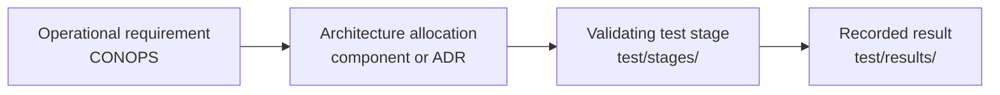

# Verification

Verification answers one question: does the thing that was built do what the
operational concept required?

## Traceability

Traceability in this program runs in a single chain:

**A requirement with no validating stage is a defect.** Not a gap to be filled
later, not a nice-to-have: a defect, reported by the build. A requirement
nobody can test is a requirement nobody can be wrong about, and it will be
declared satisfied at the end of the program by whoever is most tired.

The same applies to a binding requirement with no architecture allocation. If
no component owns it, nothing implements it.

## Traceability is a build artifact

Requirement-bearing documents carry structured frontmatter. See
`docs/README.md` for the schema.

`tools/gen-traceability.sh` reads that frontmatter and produces the matrix.
The CI check **fails the build** when any `shall` requirement lacks either an
allocation or a validating stage.

This is deliberate and it is not negotiable in review. **Hand-extracted
traceability has already failed once in this program's history.** It failed at
a smaller scale than the program now operates at, with fewer requirements and
one person holding all of them in their head. Recreating it by hand at a larger
scale would fail again, later, and more expensively.

**The requirement set is now populated.** `docs/verification/requirements.md`
carries the **33 operational success criteria of CONOPS section 79** as
structured requirements, with the validating stage taken from the CONOPS section
85 verification traceability matrix. All 33 are binding, all 33 have an
allocation and a stage, and the check reports zero defects.

That is not the full set. CONOPS v1.01 carries **145 `[SHALL]` markers**, of
which SAD section 35.1 traces **140** as system, operational or policy clauses.
That clause-level decomposition lives in **SAD section 35.2** and belongs in the
TRD; it is deliberately not duplicated here, because a second hand-maintained
copy of a 140-row table is exactly the drift these rules exist to prevent.

## The Integrated Test and Evaluation Plan

`FML-MULE-ITEP-v0.1.md` is the program-control document SAD section 33.1 names
as the next one to write. It converts the SAD section 30.3 trade dependency
graph and the CONOPS section 78 stages into **eleven campaigns**, each with a
rig, instrumentation, a procurement gate, an evidence path and a function owner.

Two things it deliberately does not contain, both for the same reason the SAD
gives:

- **No dates.** SAD section 30.2 does not baseline a schedule, so neither does
  the plan. Sequencing is dependency-ordered tranches.
- **No stage pass criteria.** Those need `TBR-HW-01`. Campaigns close trades;
  they do not qualify the design, and confusing the two would let the program
  believe it had verified requirements it had only informed.

**`tools/validate-docs.sh` fails the build if an open trade has no campaign**,
so the plan cannot fall behind the register.

The plan's first campaign, `ITEP-C01`, requires no hardware, no purchase and no
procurement gate. It can begin today.

## Qualification stages

`test/stages/` holds one directory per qualification stage. A stage defines
what is being demonstrated, on what configuration, under what conditions, with
what pass criteria, and what evidence it produces.

`test/stages/` now holds **one directory per CONOPS section 78 stage**, thirteen
in total, each recording that stage's scope, the section 79 criteria it
validates, the decisions it exercises and the trades expected to close there.

**No stage is defined.** Recording scope is not defining a stage: a definition
needs pass criteria, and pass criteria need a selected hardware block
(`TBR-HW-01`) and measured baselines. Writing thresholds now would mean
inventing them for hardware nobody has chosen.

### Criterion 33 is about this repository

CONOPS section 79 criterion 33 is that **the program can be maintained by more
than one qualified person**, verified by inspection at Stage 13, sourced from
CONOPS section 76.

It is the same property the cold start drill below tests, the same property
`hardware/blocks/_template/assembly/BUILD-ACCEPTANCE.md` tests for a build
guide, and the same property `MAINTAINERS.md` currently records as **unmet**,
with every role `VACANT`.

The one gate that exists today is the **promotion gate** in
`os/release/README.md`: a candidate compatibility set must rebuild all
out-of-tree modules, boot, enumerate every radio, form a mesh, serve the access
point, pass a traffic smoke test, survive a reboot, and demonstrate rollback.
That is a build-acceptance gate rather than a qualification stage, but it is
the first real verification the program will perform.

## Evidence tiers

Verification here has three tiers, and conflating them is the failure this
section exists to prevent.

| Status | Produced by | Supports |
| --- | --- | --- |
| `UNVERIFIED` | nothing | nothing |
| `SIMULATED` | the flat-sat, `test/flatsat/` | software logic, integration, user flow |
| `HARDWARE-VERIFIED` | ITEP campaigns on real hardware | physical behaviour |

**All testing is hypothetical until someone brings hardware to the loop.** Code
written now is expected to be correct and exercised end to end; it simply cannot
be *known* to work on a node. `SIMULATED` records that honestly, and never
substitutes for a qualification stage.

The flat-sat's first target is the `ROADMAP.md` `v0.0.1` acceptance criterion,
because they are the same flow: one node, one service, reachable from a client,
end to end.

## What CI verifies, and what it does not

**CI has no radios, no battery, and no enclosure.** A green pipeline means the
files parse, the linters are satisfied, the fakes pass, and the documents are
internally consistent. It says nothing about whether the system works.

This is stated at greater length in `test/README.md`, and it is repeated here
because the two audiences differ: a contributor reads `test/README.md`, and
someone assessing the program's maturity reads this file.

Hardware-in-the-loop verification belongs to the qualification stages and to
nothing else.

## The cold start drill

The most likely way this program's documentation fails is not that it is wrong.
It is that it is complete only to its author, who cannot see the steps they
perform without noticing.

**Every hardware project believes its instructions are complete. None are.**

### The drill

Someone who did **not** write the documentation clones the repository and
follows it to a working state, using only what is in the repository.

Rules:

1. The participant may not ask the author questions during the drill. If they
   get stuck, that is the result.
2. Every point of confusion, every missing step, every assumed piece of
   knowledge, and every command that did not work becomes an **issue**. Not a
   note, not a conversation: an issue, in the tracker, where it will be fixed.
3. The participant records where they stopped and why.
4. The author does not defend the documentation during the drill. They read the
   issues afterwards.

### Cadence

**Quarterly.** Scheduled, not triggered by someone feeling that it might be
time.

A drill that is skipped is recorded as skipped in `CHANGELOG.md`, because a
silently skipped drill is indistinguishable from a drill that was never
scheduled.

### Scope, by program stage

The drill is scoped to what the repository currently claims to support. It is
not a test of whether the program is finished.

- **Now, pre-`v0.0.1`:** clone, read `README.md`, and answer four questions in
  writing. What is this program? What stage is it at? What is unknown? What
  could I help with? A participant who cannot answer these has found a real
  defect in the front door.
- **At `v0.0.1`:** build one node, run one service, reach it from a phone,
  following the repository alone. This is the milestone's acceptance criterion,
  and the drill is how it is judged. See `ROADMAP.md`. It overlaps CONOPS Stage
  1 without being it: Stage 1 tests the node, the drill tests the
  documentation.
- **After a hardware block is qualified:** complete
  `hardware/blocks/<block-id>/assembly/BUILD-ACCEPTANCE.md` end to end.

### Why it is here and not in a wiki

The drill is the program's defence against a single point of human failure. If
every maintainer becomes unavailable, this repository is what remains, and
documentation good enough for a stranger is also documentation good enough for
a successor. See `MAINTAINERS.md`.

## Records

| Location | Contents |
| --- | --- |
| `docs/verification/FML-MULE-ITEP-v0.1.md` | The Integrated Test and Evaluation Plan: eleven campaigns closing the sixteen trades. |
| `docs/verification/requirements.md` | The 33 CONOPS section 79 criteria as structured requirements. |
| `docs/verification/traceability.md` | Generated matrix. Never hand-edited. |
| `test/stages/` | One directory per CONOPS section 78 stage. Scope recorded; definitions pending. |
| `test/bench/` | Bench procedures and instrumentation notes. |
| `test/results/` | Measured data from stage execution. Structured, currently empty. |
| `docs/evidence/<TRADE-ID>/` | Evidence that closes a trade. Distinct from stage results. |

Trade evidence and stage results are kept apart on purpose. A trade closes a
question during design; a stage validates a requirement against a build. The
same measurement may legitimately appear in both, and where it does, one cites
the other rather than being copied.
